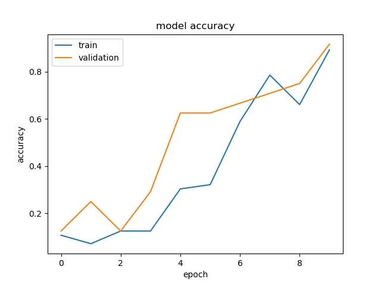
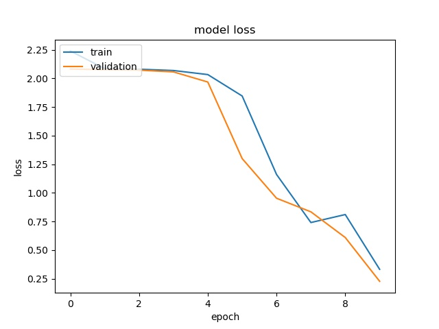
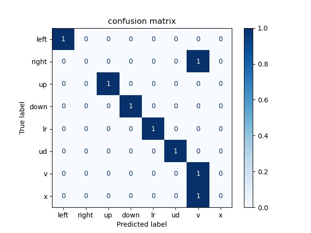

# Gesture_recognition

结合注意力机制的卷积神经网络,多维度特征融合的手势识别算法。

参考文献：李楚杨. 基于毫米波雷达的手势识别算法研究[D].电子科技大学,2020.DOI:10.27005/d.cnki.gdzku.2020.003496.

本部分主要实现参考文献的第三章——结合注意力机制的 CNN 多维度特征融合识别算法。

## Keras

因为偷懒的原因，本项目使用 Keras 框架。

总体来说，Kears 是对 Tensorflow 的包装，所以调用的是同个框架，算法效率精度上没有差别；
Kears 代码更简洁，容易上手，但扩展性不高，功能性不如 TensorFlow。

以下内容来自于[Keras和tensorflow的区别](https://blog.csdn.net/zhangbaoanhadoop/article/details/82111056)。

Keras 是一个高级的 Python 神经网络框架，文档详细。

Keras 已经被添加到 TensorFlow 中，成为其默认的框架，为TensorFlow 提供更高级的API。 

如果不想了解 TensorFlow 的细节，只需要模块化，那么 Keras 是一个不错的选择。如 
果将 TensorFlow 比喻为编程界的 Java 或 C++，那么 Keras 就是编程界的 Python。它作为 
 TensorFlow 的高层封装，可以与TensorFlow 联合使用，用它很速搭建原型。

另外，Keras 兼容两种后端，即 Theano 和TensorFlow，并且其接口形式和 Torch 有几分相 
像。掌握Keras 可以大幅提升对开发效率和网络结构的理解。

### Keras 的优点 
Keras 是高度封装的，非常适合新手使用，示例代码也比较多，文档和我论区也比较完善。
最重要的是，Keras 是TensorFlow 官方支持的。当机器上有可用的 GPU 时，代码会自动调用GPU 进行并行计算。

Keras 官方网站上描述了它的几个优点，具体如下。 
	● 模块化：模型的各个部分，如神经层、成本函数、优化器、初始化、激活函数、规范 
	化都是独立的模块，可以组合在一起来创建模型。 
	● 极简主义：每个模块都保持简短和简单。 
	● 易扩展性：很容易添加新模块，因此Keras 适于做进一步的高级研究。 
	● 使用Python 语言：模型用Python 实现，非常易于调试和扩展。 

###  Keras 的模型 
Keras 的核心数据结构是模型。模型是用来组织网络层的方式。模型有两种，一种叫 Sequential 模型，
另一种叫 Model 模型。Sequential 模型是一系列网络层按顺序构成的栈，是单输入和单输出的，
层与层之间只有相邻关系，是最简单的一种模型。Model 模型是用来建立更复杂的模型的。

这里先介绍简单的 Sequential 模型的使用（后面将会以一个示例来介绍 Model 模型）。首先 
是加载数据，这里我们假设数据已经加载完毕，是X_train, Y_train 和X_test, Y_test。然后构建模型

```python
from keras.models import Sequential 
from keras.layers import Dense, Activation 
model = Sequential() 
model.add(Dense(output_dim=64, input_dim=100)) 
model.add(Activation("relu")) 
model.add(Dense(output_dim=10)) 
model.add(Activation("softmax"))
```

然后，编译模型，同时指明损失函数和优化器。

```python
model.compile(loss="categorical_crossentropy", optimizer="sgd", metrics=["accuracy"])
```

最后，训练模型和评估模型。

```python
model.fit(X_train, Y_train, nb_epoch=5, batch_size=32) 
loss_and_metrics = model.evaluate(X_test, Y_test, batch_size=32)
```

这就是一个最简单的模型的使用。如果要搭建复杂的网络，可以使用 Keras 的 Model 模型， 
它能定义多输出模型、含有共享层的模型、共享视觉模型、图片问答模型、视觉问答模型等。

在 Keras 的源代码的 examples 文件夹里还有更多的例子。 

###  Keras 的使用 
我们下载 Keras 代码①到本地目录，将下载后的目录命名为 keras。

Keras 源代码中包含很多示例，例如： 
	● CIFAR10—图片分类（使用CNN 和实时数据）； 
	● IMDB—电影评论观点分类（使用LSTM）； 
	● Reuters—新闻主题分类（使用多层感知器）； 
	● MNIST—手写数字识别（使用多层感知器和CNN）； 
	● OCR—识别字符级文本生成（使用LSTM）。 

这里我们主要用MNIST 示例进行讲解。 
#### 安装 
Keras 的安装非常简单，不依赖操作系统，直接通过 pip 命令安装。

```python
pip install keras 
```

安装完成后，需要选择依赖的后端，在~/.keras/keras.json 下修改最后一行backend 对应的 
值即可。修改后的文件如下。

```python
{ 
“image_dim_ordering”: “tf”, 
“epsilon”: 1e-07, 
“floatx”: “float32”, 
“backend”: “tensorflow” 
} 
```

#### 实现一个网络模型 
主要分为加载数据、模型构建、模型编译、模型训练、模型评估或者模型预测几步。下面我们 
就用最简单的MNIST 示例来看如何用 Keras 实现一个卷积神经网络（CNN）。 

首先，定义好一参数以及加载数据，如下。

```python
batch_size = 128 
nb_classes = 10 # 分类数 
nb_epoch = 12 # 训练轮数 
# 输入图片的维度 
img_rows, img_cols = 28, 28 
# 卷积滤镜的个数 
nb_filters = 32 
# 最大池化，池化核大小 
pool_size = (2, 2) 
# 卷积核大小 
kernel_size = (3, 3)

(X_train, y_train), (X_test, y_test) = mnist.load_data() 
if K.image_dim_ordering() == "th": 
	# 使用Theano 的顺序：(conv_dim1, channels, conv_dim2, conv_dim3) 
	X_train = X_train.reshape(X_train.shape[0], 1, img_rows, img_cols) 
	X_test = X_test.reshape(X_test.shape[0], 1, img_rows, img_cols) 
	input_shape = (1, img_rows, img_cols) 
else: 
	# 使用TensorFlow 的顺序：(conv_dim1, conv_dim2, conv_dim3, channels) 
	X_train = X_train.reshape(X_train.shape[0], img_rows, img_cols, 1) 
	X_test = X_test.reshape(X_test.shape[0], img_rows, img_cols, 1) 
	input_shape = (img_rows, img_cols, 1) 

X_train = X_train.astype("float32") 
X_test = X_test.astype("float32") 
X_train /= 255 
X_test /= 255 
# 将类向量转换为二进制类矩阵 
Y_train = np_utils.to_categorical(y_train, nb_classes) 
Y_test = np_utils.to_categorical(y_test, nb_classes)
```

下面来构建模型，这里用 2 个卷积层、1 个池化层和 2 个全连接层来构建，如下。

```python
model = Sequential() 
model.add(Convolution2D(nb_filters, kernel_size[0], kernel_size[1], 
border_mode="valid", 
input_shape=input_shape)) 
model.add(Activation("relu")) 
model.add(Convolution2D(nb_filters, kernel_size[0], kernel_size[1])) 
model.add(Activation("relu")) 
model.add(MaxPooling2D(pool_size=pool_size)) 
model.add(Dropout(0.25)) 
model.add(Flatten()) 
model.add(Dense(128)) 
model.add(Activation("relu")) 
model.add(Dropout(0.5)) 
model.add(Dense(nb_classes)) 
model.add(Activation("softmax")) 
```

随后，用model.compile()函数编译模型，采用多分类的损失函数，用 Adadelta 算法做优化方法，如下。

```python
model.compile(loss="categorical_crossentropy", 
optimizer="adadelta", 
metrics=["accuracy"]) 
```

然后，开始用model.fit()函数训练模型，输入训练集和测试数据，以及 batch_size 和 nb_epoch 参数，如下。

```python
model.fit(X_train, Y_train, batch_size=batch_size, nb_epoch=nb_epoch, 
verbose=1, validation_data=(X_test, Y_test))
```

最后，用model.evaluate()函数来评估模型，输出测试集的损失值和准确率，如下。

```python
score = model.evaluate(X_test, Y_test, verbose=0) 
print("Test score:", score[0]) 
print("Test accuracy:", score[1])
```

计算出的损失值和准确率如下。

```python
Test score: 0.0327563833317 
Test accuracy: 0.9893
```

这是一个非常简单的例子。尽管模型架构是不变的，但是要将其应用到自己的开发领 
域，一般是先读懂对应的神经网络论文，然后用这个架构去搭建和训练模型。

#### 模型的加载及保存 

Keras 的 save_model 和 load_model 方法可以将Keras 模型和权重保存在一个 HDF5 文件中， 
这里面包括模型的结构、权重、训练的配置（损失函数、优化器）等。如果训练因为某种原因
而中止，可以保存以待后续继续训练。

```python
from keras.models import save_model, load_model

def test_sequential_model_saving(): 
	model = Sequential() 
	model.add(Dense(2, input_dim=3)) 
	model.add(RepeatVector(3)) 
	model.add(TimeDistributed(Dense(3))) 
	model.compile(loss=objectives.MSE, 
				optimizer = optimizers.RMSprop(lr=0.0001), 
				metrics = [metrics.categorical_accuracy], 
				sample_weight_mode = "temporal") 
	x = np.random.random((1, 3)) 
	y = np.random.random((1, 3, 3)) 
	model.train_on_batch(x, y) 
	out = model.predict(x) 
	_, fname = tempfile.mkstemp(".h5") # 创建一个HDFS 5 文件 
	save_model(model, fname) 
	new_model = load_model(fname) 
	os.remove(fname) 
	out2 = new_model.predict(x) 
	assert_allclose(out, out2, atol=1e-05) 
	# 检测新保存的模型和之前定义的模型是否一致 
	x = np.random.random((1, 3)) 
	y = np.random.random((1, 3, 3)) 
	model.train_on_batch(x, y) 
	new_model.train_on_batch(x, y) 
	out = model.predict(x) 
	out2 = new_model.predict(x) 
	assert_allclose(out, out2, atol=1e-05)
```

如果只是希望保存模型的结构，而不包含其权重及训练的配置（损失函数、优化器），可 
以使用下面的代码将模型序列化成 json 或者 yaml 文件。

```python
json_string = model.to_json() 
json_string = model.to_yaml()
```

保存完成后，还可以手动编辑，并且使用如下语句进行加载。

```python
from keras.models import model_from_json 
model = model_from_json(json_string) 
model = model_from_yaml(yaml_string) 
```

如果仅需要保存模型的权重，而不包含模型的结构，可以使用 save_weights 和 load_weights 语句来保存和加载。

```python
model.save_weights("my_model_weights.h5") 
model.load_weights("my_model_weights.h5")
```

## 安装依赖
pip install -r requirements.txt

## 文件说明
1. data
所有与模型相关的数据集，包括训练集、验证集和测试集。
2. history
模型训练过程可视化的结果。
3. model
保存模型结构及其权重。
4. test_img
用于生成测试集的图片集。
5. train_img
用于生成训练集的图片集。
6. valid_img
用于生成验证集的图片集。
7. config.json
程序运行的配置文件。
8. DataGet.py
由图片集生成数据集，从数据集加载数据和标签。
9. Gesture_recognition.py
程序运行的入口，评估测试集。
10. ImgSave.py
模型训练可视化，绘制混淆矩阵。
11. ModelCreate.py
创建模型，训练模型。

## 配置

loadmodel: 0: 重新训练模型并保存权重 1: 加载已训练过的模型权重

dataupdate: 0: 不更新数据集 1: 更新数据集(图片集发生变化)

showmodel: 0: 不展示网络结构 1: 展示网络结构

showhistory: 0: 不呈现训练过程的可视化 1: 训练过程可视化并保存图片

learning_rate: 学习率

batch_size: 一次训练所抓取的数据样本数量

epochs: 循环次数

train_img_nums: 训练图片的总数

valid_img_nums: 验证图片的总数

test_img_nums: 测试图片的总数

## 网络结构

模型的网络层结构如下表所示，卷积层和池化层采用 ReLU 作为激活函数，
有关网络层的部分可以参见 keras 的 layer API [文档](https://keras.io/api/layers/)。

模型的构建详见 function [create_model](ModelCreate.py)。

值得注意的是，特征融合部分，将输入该部分的特征图 F 和经过变换的注意力谱 FC2 相结合，
其中控制二者比例的系数 a 是可学习参数。

|操作|核长|步长|输出维度|备注|
|---|---|---|---|---|
|输入|/|/|224x224x3|/|
|特征提取模块|
|conv*2|3|1|224x224x32|block_1|
|maxpool|2|2|112x112x32|block_1|
|conv*2|3|1|112x112x64|block_2|
|maxpool|2|2|56x56x64|block_2|
|conv*3|3|1|56x56x128|block_3|
|maxpool|2|2|28x28x128|block_3|
|conv*3|3|1|28x28x256|block_4|
|maxpool|2|2|14x14x256|block_4|
|conv*3|3|1|14x14x512|block_5|
|maxpool|2|2|7x7x512|block_5|
|特征融合|
|reshape|/|/|49x512|/|
|Reshape&transpose|/|/|512x49|/|
|multiply&Softmax|/|/|512x512|相关性信息|
|multiply|/|/|49x512|注意力谱|
|plus&reshape|/|/|7x7x512|残差结构|
|识别结果输出|
|conv*3|3|1|7x7x512|/|
|FC*3|/|/|8|/|
|Softmax|/|/|8|类别预测概率|

## 算法训练相关设置

|名称|具体内容|
|---|---|
|最大训练迭代次数|500|
|初始学习率|0.001|
|Batch 大小|8|
|损失函数|交叉熵损失|
|优化算法|Adam|

可以在 model.compile 时指定优化器为 Adam，损失函数为 sparse_categorical_crossentropy, 
性能指标为 sparse_categorical_accuracy。

最大训练迭代次数、初始学习率、Batch 大小可在 config.json 中设定。

因在算法训练过程中，为达到更好的训练效果，学习率应随算法训练进程而改
变，训练进程越深入，学习率应越小，从而得到更加精细的参数优化，本章算法训
练的初始学习率设置为 0.001，设计每 30 个训练迭代次数后，学习率变为上一阶
段的 0.5 倍。

学习率衰减详见 function [decay_schedule](ModelCreate.py)，
通过设定回调函数（从 callbacks 中导入 LearningRateScheduler），可在训练过程中调制学习率。

## 数据

每类手势对应一个数字(0 - 7)，训练集、验证集和测试集分别放在一个文件夹下，每个文件夹下有八个文件夹对应八类手势。

如果不需要更新数据集，则直接载入已经预先处理过的 pkl 文件，得到数据和对应的标签。

如果需要更新数据集，在训练前会将三个数据集文件夹下的图片载入进来，打包成三个 pkl 文件。

详见[DataGet](DataGet.py)。

## 训练

详见 function [model_train](ModelCreate.py)。

首先设定用于学习率衰减的回调函数，接着从相应的 pkl 文件中导入训练集和验证集，
在 model.fit 中设置好 epochs、batch_size 和回调函数等后即可开始训练，并返回训练过程中的准确率和损失。

## 可视化

accuracy & loss 可视化见 function [historysave](ImgSave.py)。

混淆矩阵可视化见 function [confusionsave](ImgSave.py)。

这里可视化与前面作业中实现的可视化并没有区别，唯一不同的是在混淆矩阵的可视化使用了 sklearn.metrics 库来实现。

## 验证效果





 
